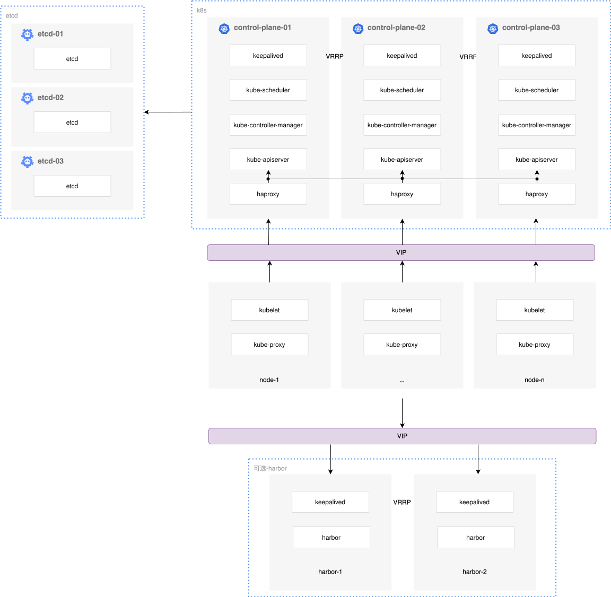

# Kubernetes 部署架构

本资源包中包含了 k8s_1.28.15 的安装、维护脚本。需配合 K8S 集群管理工具 [PangeeCluster](https://github.com/opencmit/pangee-cluster) 使用。

## 高可用架构

Kubernetes 的高可用部署架构如下图所示：

- ETCD 集群自行提供高可用能力；
- 每一个 control-plane 节点上都部署了 keepalived 和 haproxy，用于为 kube-apiserver 组件提供高可用及负载均衡；
  - 各节点以及 Kubernetes 客户端，通过 control-plane 节点的虚拟 IP 访问到某一个节点上的 haproxy 组件，然后由 haproxy 将负载分发到后端的 kube-apiserver 组件。

> - 注意：确保在干净的系统上安装集群，不要使用曾经装过 kubeadm、docker 或其他 k8s 发行版的系统

## 节点配置需求

| 角色               | 数量 | 描述                                                                                                                   |
| ------------------ | ---- | ---------------------------------------------------------------------------------------------------------------------- |
| 部署节点           | 1    | 运行 pangee-cluster 的节点，通常使用第一个 control-plane 节点                                                          |
| control-plane 节点 | 2    | 高可用集群至少需要 2 个 control-plane 节点                                                                             |
| etcd 节点          | 3    | ETCD 集群的节点数量必须为奇数个，为了确保高可用，etcd 节点数量不能低于 3，可以为 3,5,7...，可以复用 control-plane 节点 |
| node 节点          | n    | 运行应用负载的工作节点，可根据实际需要调整机器的配置、增加或减少节点数量                                               |

### 机器配置：

- control-plane 节点： 4 CPU、8G 内存、 50G 硬盘
- node 节点：建议 8CPU、32G 内存、200G 硬盘以上

### 磁盘分区：

集群安装后，占用空间较大的目录都被放置在 `/apps` 路径下，如因为磁盘分区特殊，需要调整此路径，请修改 `root_dir` 变量。

- ETCD 数据路径： `{{ root_dir }}/etcd_data/etcd`
- kubernetes 二进制路径： `{{ root_dir }}/kubernetes`
- kubernetes 日志路径：`{{ root_dir }}/log/kubernetes`
